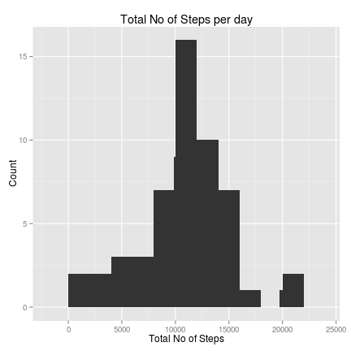

## Reproducible Research: Peer Assessment 1

### Initial Preparation
Before we get started on answering the questions, make sure of the following:

- Fork the RepData_PeerAssessment1 directory at github
- Use the `setwd("path/where/the/files/are/located")`
- Unzip the activity.zip file to obtain activty.csv file


### Loading and preprocessing the data

Load the data into R:


```r
activity <- read.csv("activity.csv", header=T)
```

To see what kind of variables are listed in the activity data frame


```r
str(activity)
```

```
## 'data.frame':	17568 obs. of  3 variables:
##  $ steps   : int  NA NA NA NA NA NA NA NA NA NA ...
##  $ date    : Factor w/ 61 levels "2012-10-01","2012-10-02",..: 1 1 1 1 1 1 1 1 1 1 ...
##  $ interval: int  0 5 10 15 20 25 30 35 40 45 ...
```

The variables are steps, date and interval. Note that date variable is a factor. Convert the date variable from a factor into a proper R date variable. 


```r
activity[,2] <- as.Date(activity[,2]) # The second column is the date variable
class(activity$date)                  # To ensure that the date variable is the date format
```

```
## [1] "Date"
```

### What is mean total number of steps taken per day?

Sum the values by date using the `tapply()` function. We convert the resulting array into a data frame and use the ggplot2 package to get the histogram of the total no of steps.


```r
totalSteps <- tapply(activity$steps, activity$date, sum)     # Returns an array of the sums by date
totalStepsDf  <- as.data.frame(totalSteps)                   # Convert array to a data frame
totalStepsDf$date <- rownames(totalStepsDf)                  # Convert the rownames into a column
rownames(totalStepsDf) <- NULL                               # Remove the rownames
library(ggplot2)                                             # Using the ggplot2 package
hist <- qplot(totalSteps, data = totalStepsDf)               # Set the plot
hist + geom_histogram(binwidth=2000) +                       # Set the width of the bins
  labs(y = "Count") +                                        # Set label for y axis
  labs(x = "Total No of Steps") +                            # Set label for x axis
  labs(title = "Total No of Steps per day")                  # Set the title of the plot
```

```
## stat_bin: binwidth defaulted to range/30. Use 'binwidth = x' to adjust this.
```

 

```r
## Calculate the mean and median
meanSteps  <- mean(totalStepsDf$totalSteps, na.rm=T)         # Mean no of steps
medianSteps <- median(totalStepsDf$totalSteps, na.rm = T)    # Median no of steps
```

The mean no of total steps is 1.0766 &times; 10<sup>4</sup> and the median no of steps is 10765.


### What is the average daily activity pattern?


### Imputing missing values


### Are there differences in activity patterns between weekdays and weekends?


